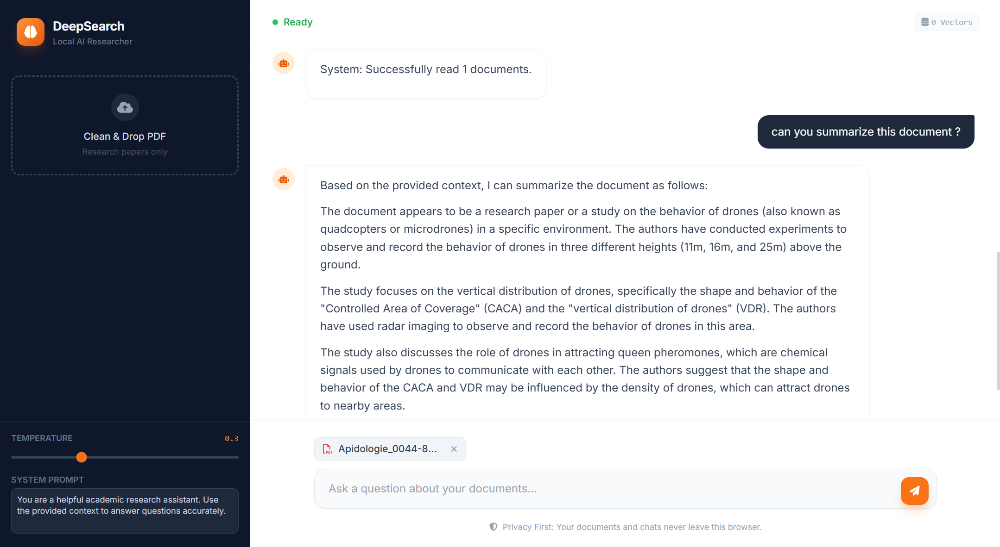

# DeepSearch: Local AI Researcher 📚

A privacy-first, fully browser-based AI research assistant. Runs entirely on the client side using **WebLLM** and **Transformers.js**.



## 🌍 Launch Live Demo
[https://bernadetvalentin-design.github.io/LLM_ResearchPaper_Analysis/](https://bernadetvalentin-design.github.io/LLM_ResearchPaper_Analysis/)

## 🚀 Features

- **Privacy First**: No data leaves your browser. Everything runs locally via WebGPU.
- **RAG Engine**:
  - Drag & Drop PDF upload.
  - Hybrid Context Injection: Uses both Vector Search (Embeddings) and Metadata Awareness (File lists) for accurate retrieval.
  - Efficient Chunking (500 chars with overlap).
- **Local LLM**:
  - Uses `Llama-3.2-1B-Instruct` (via WebGPU) for fast inference on consumer hardware.
  - **Real-time Streaming**: Responses appear token by token.
  - **Auto-Recovery**: Intelligently detects GPU crashes ("disposed" errors) and reboots the model automatically.
- **Advanced Controls**:
  - **System Prompt**: Customize the AI's personality and instructions directly from the sidebar.
  - **Temperature**: Adjust creativity (0.0 to 1.0) using the slider.
  - **Stop Generation**: Interrupt the AI instantly with the Stop button.
- **Rich UI**:
  - Markdown support (Bold, Code, Lists) via `marked.js`.
  - Sequential file upload support.
  - Modern "App-like" aesthetic with Tailwind CSS.

## 🛠️ Tech Stack

- **Core**: Vanilla JavaScript (ES Modules)
- **UI**: HTML5 + Tailwind CSS (Orange Theme) + FontAwesome
- **AI/ML**:
    - [WebLLM](https://webllm.mlc.ai/) (LLM Inference & WebGPU)
    - [Transformers.js](https://huggingface.co/docs/transformers.js/) (Embeddings: `Xenova/all-MiniLM-L6-v2`)
- **Utilities**:
    - [PDF.js](https://mozilla.github.io/pdf.js/) (PDF Text Extraction)
    - [Marked.js](https://marked.js.org/) (Markdown Rendering)

## 💻 How to Run Locally

Because this project uses ES Modules and loads external models, you **cannot** just open `index.html` file directly. You need a local web server to handle CORS and file loading.

### Option 1: Python (Recommended)

1. Open a terminal in the project folder.
2. Run:
   ```bash
   python -m http.server 8000
   ```
3. Open `http://localhost:8000` in your browser.

### Option 2: Node.js (Vite/http-server)

If you have Node installed:
```bash
npx http-server .
```